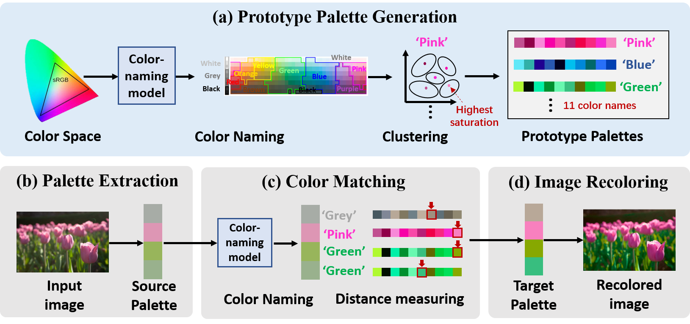

# 🎨 Palette-based Color Harmonization via Color Naming

*[Danna Xue](https://scholar.google.com.hk/citations?user=I34UZFIAAAAJ&hl=zh-CN)*<sup>1,2</sup>, *[Javier Vazquez-Corral](https://www.jvazquez-corral.net/)*<sup>2</sup>, *[Luis Herranz](https://scholar.google.com/citations?user=TIUdKu4AAAAJ&hl=en)*<sup>3</sup>, *[Yanning Zhang]*<sup>1</sup> and *[Michael S. Brown](http://www.cse.yorku.ca/~mbrown/)*<sup>4</sup>


<sup>1</sup>Northwestern Polytechnical University
<sup>2</sup>Computer Vision Center, Universitat Autònoma de Barcelona
<sup>3</sup>Universidad Autónoma de Madrid
<sup>4</sup>York University

This is the official implementation of the paper _"Palette-based Color Harmonization via Color Naming"_ published in  **IEEE-SPL**

Repo for the paper: 
[Palette-based Color Harmonization via Color Naming](https://ieeexplore.ieee.org/document/10530999)

## Overview



## Dataset:

- MIT-Adobe 5K dataset: [Download the .DNG files](https://data.csail.mit.edu/graphics/fivek/)

We used the Camera Raw tool in Photoshop, which preprocesses image colors based on the metadata of the raw images, automatically selecting configuration files such as ACR 4.4, ACR 4.6, or Adobe Standard depending on the camera model. This preprocessing method produces images with more vibrant colors, consistent with the sRGB images saved directly from camera shots. We test on the last 500 images.

- PPR10K dataset: [Download the source .tif files](https://github.com/csjliang/PPR10K?tab=readme-ov-file)

We use the validation split of the source 360p 16bit sRGB images and convert them to 8 bits.


## Code:


### Run experiment:

- How to run the code:
``` python main.py --data_dir "your_test_image_folder" --save_dir "your_results_folder"
```


## Acknowledgement:

Palette extraction and recoloring parts of the code are inspired from the matlab code [multi-image-color-consistency](https://github.com/rangnguyen/multi-image-color-consistency?tab=readme-ov-file).

The metrics calculation are from:
[NIQE](https://github.com/XPixelGroup/BasicSR)
[BRISQUE](https://github.com/bukalapak/pybrisque)
[Color Harmonization](https://github.com/ca-joe-yang/ColorHarmonization)

Color histogram visualization are from:
[Color Histogram](https://github.com/tody411/ColorHistogram)

 We thank the authors for providing the source code.


## BibTeX

If you find our work useful in your work, consider citing us.
```
@article{xue2024palette,
  author={Xue, Danna and Vazquez-Corral, Javier and Herranz, Luis and Zhang, Yanning and Brown, Michael S.},
  journal={IEEE Signal Processing Letters}, 
  title={Palette-Based Color Harmonization via Color Naming}, 
  year={2024},
  volume={31},
  pages={1474-1478},
  doi={10.1109/LSP.2024.3401612}}
```